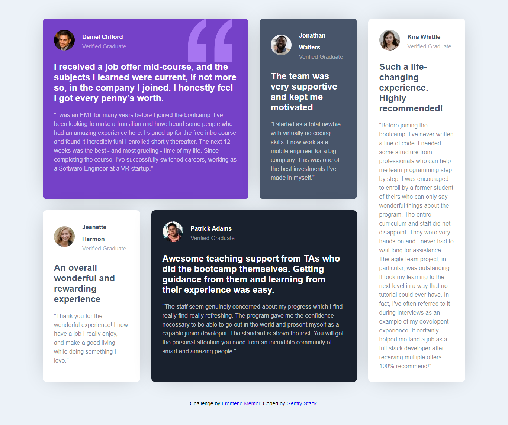

# Frontend Mentor - Testimonials grid section solution

This is a solution to the [Testimonials grid section challenge on Frontend Mentor](https://www.frontendmentor.io/challenges/testimonials-grid-section-Nnw6J7Un7). Frontend Mentor challenges help you improve your coding skills by building realistic projects. 

## Table of contents

- [Overview](#overview)
  - [The challenge](#the-challenge)
  - [Screenshot](#screenshot)
  - [Links](#links)
- [My process](#my-process)
  - [Built with](#built-with)
  - [What I learned](#what-i-learned)
  - [Continued development](#continued-development)
  - [Useful resources](#useful-resources)
- [Author](#author)

## Overview

### The challenge

Users should be able to:

- View the optimal layout for the site depending on their device's screen size

### Screenshot

### Links

- Solution URL: [Solution URL](https://github.com/gentryhq)
- Live Site URL: [Live URL](https://g)
entry.com.ng/portfolio)

## My process

### Built with

- Semantic HTML5 markup
- CSS custom properties
- Flexbox
- CSS Grid
- Mobile-first workflow
- CSS Media Query

### What I learned

- I really learnt how to play around with CSS Grid more.
- I also worked with CSS variables which made my code more cleaner and faster to write.

### Continued development

- I will like to use the CSS grid system more in my future projects as I find it really interesting and fun.

### Useful resources

- [Brad Travesy YouTube Channel](https://www.example.com) - This helped me learn CSS grid system.
- [Kelvin Powell Youtube Channel](https://www.example.com) - Kelvin's use of CSS varibles made me fall in love with using them, you check up his Youtube Channel to see. I'd recommend everyone to learn this concept.

## Author

- Website - [Gentry.com.ng](https://www.gentry.com.ng)
- Frontend Mentor - [@gentry](https://www.frontendmentor.io/profile/gentry)
- Twitter - [@iam_gentry](https://www.twitter.com/iam_gentry)

